# BÁO CÁO PHÂN TÍCH VÀ THIẾT KẾ HỆ THỐNG

## Dự án: LumiLearn LMS - Hệ thống quản lý học tập trực tuyến

## 1. Giới thiệu dự án

### 1.1. Mục tiêu

LumiLearn LMS là hệ thống quản lý học tập trực tuyến hỗ trợ nhiều nhóm người dùng gồm học viên, giảng viên, phụ huynh và quản trị viên. Hệ thống cho phép giảng viên tạo khóa học, bài học, tài liệu, bài tập và quiz; học viên đăng ký học, theo dõi tiến độ, làm bài, nhận chứng chỉ; phụ huynh theo dõi tình hình học tập và thanh toán cho con; quản trị viên kiểm duyệt, thống kê, quản lý người dùng, đơn hàng và hoàn tiền.

### 1.2. Phạm vi hiện có theo mã nguồn

| Nhóm chức năng | Nội dung hiện có |
| --- | --- |
| Xác thực | Đăng ký, đăng nhập, refresh token, đăng xuất, hồ sơ, đổi mật khẩu, quên/reset mật khẩu, quản lý phiên |
| Khóa học | Danh sách, tìm kiếm, chi tiết, tạo/sửa/xóa khóa học, gửi duyệt, duyệt/từ chối bởi admin |
| Nội dung học | Chương học, bài học, tài liệu đính kèm, video, bình luận, trả lời bình luận |
| Học tập | Ghi danh, khóa học của tôi, tiến độ khóa học, tiến độ video, kiểm tra điều kiện hoàn thành |
| Bài tập và quiz | Tạo bài tập, nộp bài, chấm điểm, tạo quiz, câu hỏi, nộp quiz, xem kết quả |
| Thương mại | Giỏ hàng, mã giảm giá, đơn hàng, sinh mã VietQR, xử lý webhook thanh toán |
| Phụ huynh | Gửi yêu cầu liên kết con, học viên chấp nhận/từ chối, xem tiến độ, khóa học, dashboard, đơn hàng, điểm số |
| Chứng chỉ | Sinh chứng chỉ sau khi học xong, xem danh sách chứng chỉ, xác minh chứng chỉ bằng mã |
| Gamification | Streak học tập, huy hiệu, bảng xếp hạng thành tích, cuộc đua tháng, mã giảm giá theo thành tích |
| Ví giảng viên | Ghi nhận doanh thu, ví, thông tin ngân hàng, yêu cầu rút tiền, admin duyệt/từ chối payout |
| Quản trị | Dashboard, người dùng, khóa học, bài học, đơn hàng, thống kê doanh thu, hoàn tiền, kiểm tra queue |
| Upload/media | Upload ảnh, file, video; kiểm tra MIME, dung lượng, magic bytes; xử lý media asset và phục vụ file |

---

## 2. Công nghệ sử dụng

| Thành phần | Công nghệ | Vai trò |
| --- | --- | --- |
| Frontend | Next.js 15, React 19, TypeScript | Xây dựng giao diện người dùng |
| UI | Tailwind CSS, Radix UI, lucide-react, shadcn-style components | Thành phần giao diện, form, dialog, bảng, nút |
| Gọi API | Axios | Kết nối frontend với backend, tự refresh token khi 401 |
| Video | hls.js, react-player | Phát video/HLS trong bài học |
| Backend | NestJS 11, TypeScript | API, module nghiệp vụ, guard, service |
| ORM | Prisma 6 | Ánh xạ model và truy vấn PostgreSQL |
| Database | PostgreSQL | Lưu dữ liệu quan hệ |
| Queue/cache | Redis, Bull | Xử lý tác vụ nền như email, certificate, video, wallet |
| File storage | Local uploads, S3/MinIO SDK | Lưu ảnh, file, video, media asset |
| Bảo mật | JWT, Passport, bcrypt, role guard, throttler | Xác thực, phân quyền, giới hạn request |
| PDF | pdfkit | Sinh chứng chỉ |

---

## 3. Kiến trúc tổng thể

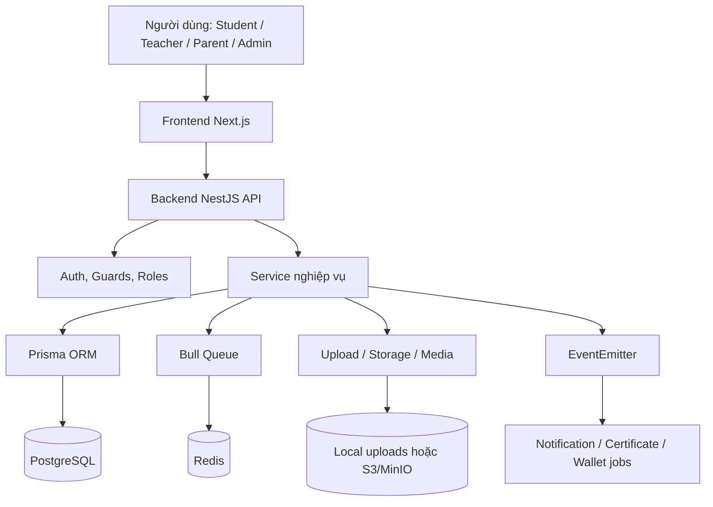

### 3.1. Phân lớp backend

| Lớp | Mô tả |
| --- | --- |
| Controller | Nhận HTTP request, lấy dữ liệu từ body/query/param, áp dụng guard và role |
| Service | Xử lý nghiệp vụ chính như tạo đơn hàng, ghi danh, chấm điểm, xử lý webhook |
| Repository | Một số module dùng repository để tách truy vấn dữ liệu khỏi service |
| Prisma schema | Định nghĩa bảng, quan hệ, enum và index |
| Guard/decorator | `JwtAuthGuard`, `RolesGuard`, `OptionalJwtGuard`, `@GetUser`, `@Roles` |
| Event/Queue | Phát sự kiện nghiệp vụ và đẩy tác vụ nặng sang Bull queue |

### 3.2. Phân lớp frontend

| Lớp | Mô tả |
| --- | --- |
| `app/` | Các route chính theo Next.js App Router |
| `components/` | UI dùng lại cho auth, khóa học, admin, layout, dashboard |
| `lib/api-service.ts` | Tập trung các hàm gọi API theo nhóm nghiệp vụ |
| `hooks/useAuth.ts` | Hook xử lý trạng thái xác thực |
| `types/` | Kiểu dữ liệu dùng chung phía frontend |

---

## 4. Tác nhân hệ thống

| Tác nhân | Mô tả | Quyền/chức năng chính |
| --- | --- | --- |
| Khách | Người chưa đăng nhập | Xem trang chủ, danh sách khóa học, chi tiết công khai, giáo viên, đăng ký/đăng nhập |
| Học viên | Người học | Ghi danh/mua khóa học, học bài, xem tiến độ, làm bài tập/quiz, bình luận, nhận chứng chỉ |
| Giảng viên | Người tạo khóa học | Tạo khóa học, chương, bài học, tài liệu, bài tập, quiz; xem bài nộp; chấm điểm; quản lý ví |
| Phụ huynh | Người theo dõi học viên | Liên kết với con, xem tiến độ/điểm/đơn hàng, nhận thông báo thanh toán, gửi yêu cầu hoàn tiền |
| Quản trị viên | Người vận hành hệ thống | Quản lý user, khóa học, bài học, đơn hàng, doanh thu, refund, payout, queue |
| Hệ thống ngân hàng/SePay | Tác nhân ngoài | Gửi webhook xác nhận giao dịch thanh toán |
| Hàng đợi nền | Thành phần hệ thống | Xử lý email, chứng chỉ, video, ví/doanh thu |

---

## 5. Danh sách màn hình frontend hiện có

| Route | Chức năng |
| --- | --- |
| `/` | Trang chủ/landing |
| `/auth/login` | Đăng nhập |
| `/auth/register` | Đăng ký |
| `/auth/forgot-password` | Quên mật khẩu |
| `/auth/reset-password` | Đặt lại mật khẩu |
| `/courses` | Danh sách khóa học |
| `/courses/[id]` | Chi tiết khóa học |
| `/courses/[id]/lessons/[lessonId]` | Màn hình học bài |
| `/courses/[id]/lessons/[lessonId]/assignment/[assignmentId]` | Làm/nộp bài tập |
| `/quiz/[id]` | Làm quiz |
| `/cart` | Giỏ hàng |
| `/orders` | Danh sách đơn hàng |
| `/orders/[id]` | Chi tiết đơn hàng/thanh toán |
| `/dashboard` | Dashboard học viên |
| `/profile` | Hồ sơ cá nhân |
| `/notifications` | Thông báo |
| `/certificates` | Chứng chỉ của học viên |
| `/courses/[id]/certificate` | Chứng chỉ của một khóa học |
| `/achievements` | Thành tích, huy hiệu, leaderboard |
| `/monthly-race` | Cuộc đua tháng |
| `/parent` | Dashboard phụ huynh |
| `/teacher` | Dashboard giảng viên |
| `/teacher/courses/new` | Tạo khóa học theo nhiều bước |
| `/teacher/courses/[id]` | Quản lý/chỉnh sửa khóa học |
| `/teacher/grades` | Quản lý bài nộp và điểm |
| `/teachers` | Danh sách giáo viên |
| `/teachers/[id]` | Hồ sơ giáo viên |
| `/admin` | Khu vực quản trị |
| `/about`, `/contact`, `/help`, `/privacy`, `/terms` | Trang thông tin phụ |

---

## 6. Biểu đồ use case tổng quát

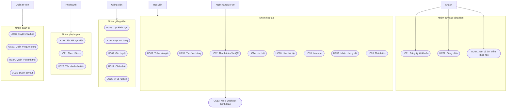

---

## 7. Danh sách use case

| Mã UC | Tên use case | Tác nhân chính | Mục tiêu |
| --- | --- | --- | --- |
| UC01 | Đăng ký tài khoản | Khách | Tạo tài khoản student/teacher/parent |
| UC02 | Đăng nhập | Người dùng | Nhận access token và refresh token |
| UC03 | Quản lý hồ sơ | Người dùng | Xem/sửa thông tin cá nhân, đổi mật khẩu |
| UC04 | Xem và tìm kiếm khóa học | Khách/Học viên | Tìm khóa học phù hợp |
| UC05 | Tạo khóa học | Giảng viên | Tạo khóa học mới ở trạng thái nháp |
| UC06 | Soạn nội dung khóa học | Giảng viên | Tạo chương, bài học, tài liệu, video |
| UC07 | Gửi duyệt khóa học | Giảng viên | Chuyển khóa học sang trạng thái chờ duyệt |
| UC08 | Duyệt/từ chối khóa học | Admin | Công khai hoặc từ chối khóa học |
| UC09 | Thêm khóa học vào giỏ | Học viên | Chuẩn bị mua khóa học |
| UC10 | Áp dụng mã giảm giá | Học viên | Giảm giá đơn hàng nếu coupon hợp lệ |
| UC11 | Tạo đơn hàng | Học viên/Phụ huynh | Chốt giỏ hàng thành order |
| UC12 | Thanh toán VietQR | Học viên/Phụ huynh | Sinh QR và thanh toán đơn hàng |
| UC13 | Xử lý webhook thanh toán | Hệ thống ngân hàng | Cập nhật payment, order, enrollment |
| UC14 | Học bài | Học viên | Xem video, tài liệu, bình luận |
| UC15 | Cập nhật tiến độ video | Học viên | Ghi nhận watch time, phần trăm xem |
| UC16 | Làm bài tập | Học viên | Nộp nội dung/file cho assignment |
| UC17 | Chấm bài | Giảng viên/Admin | Ghi điểm và phản hồi bài nộp |
| UC18 | Làm quiz | Học viên | Trả lời câu hỏi và nhận điểm |
| UC19 | Cấp chứng chỉ | Học viên/Hệ thống | Sinh chứng chỉ khi đủ điều kiện |
| UC20 | Liên kết phụ huynh - học viên | Phụ huynh/Học viên | Cho phụ huynh theo dõi con |
| UC21 | Theo dõi học tập của con | Phụ huynh | Xem dashboard, khóa học, điểm, đơn hàng |
| UC22 | Tạo yêu cầu hoàn tiền | Phụ huynh | Gửi thông tin ngân hàng khi thanh toán dư |
| UC23 | Quản lý người dùng | Admin | Tạo/sửa/xóa/khóa tài khoản |
| UC24 | Quản lý doanh thu | Admin | Xem thống kê doanh thu, chi tiết giao dịch |
| UC25 | Quản lý ví và rút tiền | Giảng viên/Admin | Giảng viên yêu cầu rút, admin xử lý |
| UC26 | Thành tích và cuộc đua tháng | Học viên | Tích streak, huy hiệu, leaderboard, coupon |

---

## 8. Đặc tả use case chính

### 8.0. Đặc tả use case toàn hệ thống

| UC | Tên use case | Tác nhân | Tiền điều kiện | Luồng chính | Luồng ngoại lệ | Hậu điều kiện |
| --- | --- | --- | --- | --- | --- | --- |
| UC01 | Đăng ký tài khoản | Khách | Người dùng chưa đăng nhập; email/username chưa tồn tại | 1. Mở trang đăng ký. 2. Nhập username, email, mật khẩu, vai trò. 3. Frontend gọi `POST /auth/register`. 4. Backend kiểm tra dữ liệu và mã hóa mật khẩu. 5. Tạo bản ghi `User`. | Email/username trùng; dữ liệu không hợp lệ; mật khẩu không đạt yêu cầu. | Tài khoản mới được tạo và có thể đăng nhập. |
| UC02 | Đăng nhập | Người dùng | Tài khoản đã tồn tại và đang hoạt động | 1. Nhập username/email và mật khẩu. 2. Frontend gọi `POST /auth/login`. 3. Backend xác thực bằng local strategy. 4. Sinh access token và refresh token. 5. Frontend lưu access token trong bộ nhớ. | Sai thông tin đăng nhập; tài khoản bị khóa; refresh token hết hạn. | Người dùng vào hệ thống theo vai trò. |
| UC03 | Quản lý hồ sơ | Người dùng | Đã đăng nhập | 1. Mở trang hồ sơ. 2. Frontend gọi `GET /auth/profile`. 3. Người dùng sửa thông tin. 4. Frontend gọi `PUT /auth/profile` hoặc `PUT /users/me`. 5. Backend cập nhật `User`. | Token hết hạn; dữ liệu không hợp lệ; email/username trùng. | Hồ sơ người dùng được cập nhật. |
| UC04 | Xem và tìm kiếm khóa học | Khách/Học viên | Không bắt buộc đăng nhập | 1. Mở `/courses`. 2. Frontend gọi `GET /courses` hoặc `GET /courses/search`. 3. Backend trả danh sách khóa học phù hợp. 4. Người dùng mở chi tiết khóa học. | Không tìm thấy khóa học; khóa học chưa published thì khách không xem được đầy đủ. | Người dùng xem được thông tin khóa học công khai. |
| UC05 | Tạo khóa học | Giảng viên/Admin | Đã đăng nhập, có role `teacher` hoặc `admin` | 1. Mở trang tạo khóa học. 2. Nhập tiêu đề, mô tả, giá, ảnh. 3. Frontend gọi `POST /courses`. 4. Backend tạo `Course` trạng thái `draft`. | Thiếu quyền; dữ liệu không hợp lệ; giá không hợp lệ. | Khóa học nháp được tạo. |
| UC06 | Soạn nội dung khóa học | Giảng viên/Admin | Có quyền sở hữu/quản lý khóa học | 1. Tạo `Section`. 2. Tạo `Lesson`. 3. Upload ảnh/video/file nếu có. 4. Tạo `Material`, `Assignment`, `Quiz`, `Question`. 5. Lưu cấu trúc nội dung. | Không có quyền; section/lesson không tồn tại; file sai định dạng; upload quá dung lượng. | Khóa học có nội dung học tập hoàn chỉnh. |
| UC07 | Gửi duyệt khóa học | Giảng viên | Khóa học thuộc giảng viên và đã có nội dung cơ bản | 1. Giảng viên bấm gửi duyệt. 2. Frontend gọi `POST /courses/:id/submit-review`. 3. Backend kiểm tra quyền. 4. Cập nhật `Course.status = pending`. | Khóa học không thuộc giảng viên; khóa học thiếu dữ liệu; trạng thái không hợp lệ. | Khóa học chuyển sang chờ admin duyệt. |
| UC08 | Duyệt/từ chối khóa học | Admin | Admin đã đăng nhập; khóa học ở trạng thái `pending` | 1. Admin xem danh sách khóa chờ duyệt. 2. Mở chi tiết khóa. 3. Bấm approve hoặc reject. 4. Backend cập nhật trạng thái `published` hoặc `rejected`. | Không có quyền admin; khóa học không tồn tại; khóa học không ở trạng thái pending. | Khóa học được công khai hoặc trả về cho giảng viên chỉnh sửa. |
| UC09 | Thêm khóa học vào giỏ | Học viên | Đã đăng nhập; khóa học tồn tại | 1. Học viên bấm thêm vào giỏ. 2. Frontend gọi `POST /cart/add`. 3. Backend kiểm tra khóa học và giỏ hàng. 4. Tạo `CartItem`. | Khóa đã có trong giỏ; khóa học không tồn tại; học viên đã mua khóa học. | Khóa học xuất hiện trong giỏ hàng. |
| UC10 | Áp dụng mã giảm giá | Học viên | Có sản phẩm trong giỏ; coupon tồn tại nếu nhập mã | 1. Nhập mã coupon. 2. Frontend gọi `POST /cart/apply-coupon`. 3. Backend kiểm tra trạng thái, hạn dùng, lượt dùng. 4. Tính giá sau giảm. | Coupon sai, hết hạn, hết lượt, không active hoặc không áp dụng được. | Tổng tiền giỏ hàng được cập nhật theo coupon hợp lệ. |
| UC11 | Tạo đơn hàng | Học viên/Phụ huynh | Người mua đã đăng nhập; có khóa học cần mua | 1. Người dùng xác nhận mua. 2. Frontend gọi `POST /orders`. 3. Backend tính `totalPrice`, `finalPrice`. 4. Tạo `Order` và `OrderItem`. 5. Đơn ở trạng thái `pending`. | Khóa học không tồn tại; khóa đã được mua; coupon không hợp lệ. | Đơn hàng pending được tạo để thanh toán. |
| UC12 | Thanh toán VietQR | Học viên/Phụ huynh | Đơn hàng pending; cấu hình ngân hàng đầy đủ | 1. Frontend gọi `POST /payments/qr`. 2. Backend kiểm tra quyền xem đơn. 3. Sinh hoặc tái sử dụng `Payment`. 4. Sinh `txnRef` và URL VietQR. 5. Người dùng quét QR thanh toán. | Đơn không pending; thiếu cấu hình ngân hàng; người gọi không phải chủ đơn/phụ huynh liên kết. | Payment pending có mã QR thanh toán. |
| UC13 | Xử lý webhook thanh toán | Ngân hàng/SePay | Payment có `txnRef`; webhook gửi về backend | 1. Backend nhận webhook. 2. Kiểm tra chữ ký nếu cần. 3. Ghi `WebhookEvent`. 4. Tìm `Payment`. 5. Kiểm tra trạng thái và số tiền. 6. Cập nhật payment/order/enrollment trong transaction. 7. Ghi `PaymentTransaction`. | Webhook trùng; không tìm thấy giao dịch; thiếu tiền; dư tiền; trạng thái failed; sai số tiền. | Đơn hàng được paid hoặc ghi nhận trạng thái xử lý phù hợp. |
| UC14 | Học bài | Học viên | Đã ghi danh hoặc có quyền truy cập khóa học | 1. Mở bài học. 2. Backend kiểm tra enrollment/quyền truy cập. 3. Trả nội dung bài học, video, tài liệu. 4. Học viên xem bài và bình luận nếu cần. | Chưa mua/ghi danh; bài học không tồn tại; khóa chưa published. | Học viên truy cập được nội dung bài học hợp lệ. |
| UC15 | Cập nhật tiến độ video | Học viên | Đang học bài có video | 1. Video player ghi nhận thời lượng đã xem. 2. Frontend gọi `PUT /progress/video`. 3. Backend upsert `VideoProgress`. 4. Cập nhật phần trăm học của enrollment nếu đủ điều kiện. | Dữ liệu watch time sai; lesson không tồn tại; người dùng không có quyền học. | Tiến độ học tập được lưu. |
| UC16 | Làm bài tập | Học viên | Học viên có quyền vào lesson chứa assignment | 1. Mở assignment. 2. Nhập nội dung hoặc file. 3. Gọi `POST /assignments/:id/submit`. 4. Backend tạo/cập nhật `Submission`. | Quá hạn nếu có kiểm tra; assignment không tồn tại; học viên không có quyền; file lỗi. | Bài nộp được lưu ở trạng thái chờ chấm. |
| UC17 | Chấm bài | Giảng viên/Admin | Có bài nộp; người chấm có quyền với khóa học | 1. Giảng viên xem danh sách submissions. 2. Chọn bài nộp. 3. Nhập điểm và feedback. 4. Gọi API chấm điểm. 5. Backend cập nhật score, feedback, status. | Không có quyền; điểm ngoài khoảng cho phép; submission không tồn tại. | Học viên xem được điểm và nhận xét. |
| UC18 | Làm quiz | Học viên | Quiz tồn tại và học viên có quyền truy cập | 1. Mở quiz. 2. Backend trả câu hỏi. 3. Học viên chọn đáp án. 4. Gọi `POST /quizzes/:id/submit`. 5. Backend tính điểm và lưu `QuizAttempt`. | Quiz không tồn tại; học viên đã làm nếu giới hạn một lần; dữ liệu đáp án sai. | Kết quả quiz được lưu và hiển thị. |
| UC19 | Cấp chứng chỉ | Học viên/Hệ thống | Học viên hoàn thành khóa học theo điều kiện | 1. Học viên yêu cầu tạo chứng chỉ. 2. Backend kiểm tra enrollment/progress. 3. Nếu đủ điều kiện, sinh mã chứng chỉ. 4. Lưu `Certificate`. 5. Cho phép tra cứu bằng code. | Chưa hoàn thành khóa; chứng chỉ đã tồn tại; khóa học không hợp lệ. | Chứng chỉ được cấp hoặc trả về chứng chỉ đã có. |
| UC20 | Liên kết phụ huynh - học viên | Phụ huynh/Học viên | Cả hai tài khoản tồn tại; phụ huynh role `parent`, con role `student` | 1. Phụ huynh nhập email/username/UUID của con. 2. Backend tạo `ParentChild` pending. 3. Học viên xem yêu cầu. 4. Học viên accept hoặc reject. | Gửi trùng yêu cầu; tài khoản con không tồn tại; sai vai trò; học viên từ chối. | Quan hệ phụ huynh - học viên được accepted hoặc rejected. |
| UC21 | Theo dõi học tập của con | Phụ huynh | Đã có liên kết `ParentChild.status = accepted` | 1. Phụ huynh mở dashboard. 2. Gọi API lấy danh sách con. 3. Chọn học viên. 4. Backend trả tiến độ, khóa học, điểm, đơn hàng. | Chưa liên kết; liên kết pending/rejected; childId không thuộc phụ huynh. | Phụ huynh xem được dữ liệu học tập của con. |
| UC22 | Tạo yêu cầu hoàn tiền | Phụ huynh | Có đơn hàng thanh toán dư; phụ huynh liên kết với học viên | 1. Phụ huynh nhập ngân hàng, số tài khoản, chủ tài khoản. 2. Gọi `POST /payments/refund-requests`. 3. Backend kiểm tra số tiền dư còn khả dụng. 4. Tạo `RefundRequest`. 5. Thông báo admin. | Không có tiền dư; yêu cầu vượt số tiền dư; thông tin ngân hàng thiếu; phụ huynh không liên kết. | Refund request pending được tạo. |
| UC23 | Quản lý người dùng | Admin | Admin đã đăng nhập | 1. Admin mở trang quản lý user. 2. Xem danh sách user. 3. Tạo/sửa/xóa/khóa tài khoản. 4. Backend cập nhật `User`. | Không có quyền admin; không được tự xóa hoặc thao tác sai chính sách; dữ liệu trùng. | Danh sách người dùng được quản lý. |
| UC24 | Quản lý doanh thu | Admin | Admin đã đăng nhập | 1. Admin mở dashboard/thống kê. 2. Gọi API doanh thu. 3. Backend tổng hợp order/payment/ledger. 4. Hiển thị doanh thu tổng, chi tiết giao dịch, khóa học. | Không có quyền; dữ liệu rỗng; lỗi truy vấn thống kê. | Admin có số liệu doanh thu để theo dõi vận hành. |
| UC25 | Quản lý ví và rút tiền | Giảng viên/Admin | Giảng viên có ví; admin có quyền duyệt payout | 1. Giảng viên xem ví. 2. Cập nhật thông tin ngân hàng. 3. Gửi yêu cầu rút tiền. 4. Admin xem payout. 5. Admin duyệt hoặc từ chối. 6. Backend cập nhật ví, payout, transaction. | Số dư không đủ; thiếu thông tin ngân hàng; payout đã xử lý; admin từ chối. | Yêu cầu rút tiền được ghi nhận và xử lý. |
| UC26 | Thành tích và cuộc đua tháng | Học viên/Hệ thống | Học viên có hoạt động học tập | 1. Học viên check-in/học bài/làm quiz. 2. Backend cập nhật streak, XP hoặc achievement. 3. Hệ thống cấp badge/coupon nếu đạt điều kiện. 4. Học viên xem leaderboard/thành tích. | Chưa đủ điều kiện; đã nhận badge/coupon trước đó; leaderboard chưa có dữ liệu. | Thành tích, huy hiệu hoặc xếp hạng được cập nhật. |

---

### 8.1. UC02 - Đăng nhập

| Mục | Nội dung |
| --- | --- |
| Tác nhân | Người dùng |
| Tiền điều kiện | Tài khoản đã tồn tại và đang hoạt động |
| Kích hoạt | Người dùng nhập username/email và mật khẩu |
| Hậu điều kiện | Người dùng nhận access token; refresh token được lưu bằng cookie |

**Luồng chính**

1. Người dùng mở trang `/auth/login`.
2. Frontend gọi `POST /auth/login`.
3. Backend dùng `LocalAuthGuard` kiểm tra thông tin đăng nhập.
4. Nếu hợp lệ, backend tạo access token và refresh token.
5. Frontend lưu access token trong bộ nhớ và dùng Axios interceptor gắn token vào request sau.
6. Người dùng được chuyển vào khu vực phù hợp theo vai trò.

**Luồng ngoại lệ**

| Trường hợp | Xử lý |
| --- | --- |
| Sai tài khoản/mật khẩu | Backend trả lỗi xác thực |
| Access token hết hạn | Frontend gọi `POST /auth/refresh`, nhận token mới |
| Refresh token không hợp lệ | Xóa trạng thái đăng nhập, chuyển về trang login |

### 8.2. UC06 - Soạn nội dung khóa học

| Mục | Nội dung |
| --- | --- |
| Tác nhân | Giảng viên hoặc admin |
| Tiền điều kiện | Người dùng đã đăng nhập và có quyền với khóa học |
| Kích hoạt | Giảng viên vào trang quản lý khóa học |
| Hậu điều kiện | Khóa học có chương, bài học, tài liệu, bài tập/quiz |

**Luồng chính**

1. Giảng viên tạo khóa học bằng `POST /courses`.
2. Giảng viên tạo chương bằng `POST /sections`.
3. Giảng viên tạo bài học bằng `POST /lessons`.
4. Nếu có file, frontend upload qua `POST /upload/file`, `POST /upload/image` hoặc `POST /upload/video`.
5. Backend kiểm tra MIME, dung lượng và magic bytes của file.
6. Giảng viên gắn tài liệu vào bài học bằng `POST /materials`.
7. Giảng viên tạo bài tập bằng `POST /assignments`.
8. Nếu là quiz, giảng viên tạo quiz bằng `POST /quizzes` và câu hỏi bằng `POST /questions`.
9. Khi hoàn tất, giảng viên gửi duyệt khóa học bằng `POST /courses/:id/submit-review`.

### 8.3. UC12 - Thanh toán VietQR

| Mục | Nội dung |
| --- | --- |
| Tác nhân | Học viên hoặc phụ huynh đã liên kết |
| Tiền điều kiện | Có đơn hàng trạng thái `pending` |
| Kích hoạt | Người dùng bấm thanh toán trong trang đơn hàng |
| Hậu điều kiện | Sinh mã QR thanh toán chứa số tiền và nội dung chuyển khoản |

**Luồng chính**

1. Người dùng tạo đơn hàng bằng `POST /orders`.
2. Frontend gọi `POST /payments/qr` với `orderId`.
3. Backend kiểm tra người gọi là chủ đơn hàng hoặc phụ huynh đã liên kết.
4. Backend kiểm tra đơn hàng còn `pending`.
5. Backend lấy cấu hình ngân hàng từ biến môi trường.
6. Nếu đã có payment pending còn hợp lệ, backend tái sử dụng QR cũ.
7. Nếu chưa có hoặc yêu cầu tạo lại, backend sinh `txnRef` mới.
8. Backend trả về URL ảnh VietQR, số tiền, tài khoản ngân hàng và nội dung chuyển khoản.
9. Người dùng quét mã QR và chuyển khoản.

**Luồng ngoại lệ**

| Trường hợp | Xử lý |
| --- | --- |
| Không có quyền xem đơn | Trả lỗi không tìm thấy đơn hàng |
| Đơn không còn pending | Trả lỗi không thể thanh toán |
| Thiếu cấu hình ngân hàng | Trả lỗi cấu hình thanh toán |

### 8.4. UC13 - Xử lý webhook thanh toán

| Mục | Nội dung |
| --- | --- |
| Tác nhân | Hệ thống ngân hàng/SePay |
| Tiền điều kiện | Payment đã được tạo và có `txnRef` |
| Kích hoạt | Ngân hàng gửi webhook về backend |
| Hậu điều kiện | Payment/order/enrollment được cập nhật nhất quán |

**Luồng chính**

1. Backend nhận webhook qua `POST /payments/webhook` hoặc `POST /payments/webhook/sepay`.
2. Backend chuẩn hóa dữ liệu giao dịch.
3. Với webhook cần chữ ký, backend kiểm tra HMAC-SHA256.
4. Backend tạo `WebhookEvent` để chống xử lý trùng.
5. Backend tìm `Payment` theo `txnRef`.
6. Nếu trạng thái thành công và số tiền khớp, backend chạy transaction:
   - cập nhật `Payment` thành `completed`;
   - cập nhật `Order` thành `paid`;
   - tăng lượt dùng coupon nếu có;
   - tạo `Enrollment` cho từng khóa học trong đơn.
7. Backend ghi `PaymentTransaction` làm ledger.
8. Backend phát event `PAYMENT_COMPLETED` để xử lý thông báo, chứng chỉ/ví hoặc tác vụ nền liên quan.

**Luồng thay thế**

| Trường hợp | Xử lý |
| --- | --- |
| Webhook bị gửi lại | Đánh dấu duplicate, không tạo enrollment lần hai |
| Chuyển thiếu tiền | Ghi ledger `partial`, cập nhật số còn thiếu, sinh `txnRef`/QR mới, gửi thông báo |
| Chuyển dư tiền | Kích hoạt đơn hàng, ghi số tiền dư, gửi thông báo cho phụ huynh/học viên |
| Trạng thái thất bại | Cập nhật payment/order thất bại và phát event `PAYMENT_FAILED` |
| Số tiền không khớp nhưng không phải success | Đánh dấu rejected để kiểm tra thủ công |

### 8.5. UC16 - Làm bài tập

| Mục | Nội dung |
| --- | --- |
| Tác nhân | Học viên |
| Tiền điều kiện | Học viên có quyền truy cập bài học/khóa học |
| Kích hoạt | Học viên mở trang assignment |
| Hậu điều kiện | Bài nộp được lưu ở trạng thái chờ chấm |

**Luồng chính**

1. Học viên mở `/courses/[id]/lessons/[lessonId]/assignment/[assignmentId]`.
2. Frontend lấy thông tin assignment bằng `GET /assignments/:id`.
3. Học viên nhập nội dung hoặc đính kèm file.
4. Frontend gọi `POST /assignments/:id/submit`.
5. Backend tạo hoặc cập nhật `Submission` theo cặp `assignmentId + studentId`.
6. Giảng viên xem bài nộp qua `GET /assignments/:id/submissions`.
7. Giảng viên chấm bằng `PUT /submissions/:id/grade` hoặc `PATCH /assignments/submissions/:submissionId/grade`.

### 8.6. UC20 - Liên kết phụ huynh với học viên

| Mục | Nội dung |
| --- | --- |
| Tác nhân | Phụ huynh, học viên |
| Tiền điều kiện | Cả hai tài khoản đã tồn tại |
| Kích hoạt | Phụ huynh nhập email/username/UUID của học viên |
| Hậu điều kiện | Quan hệ `ParentChild` được tạo và chuyển trạng thái theo phản hồi |

**Luồng chính**

1. Phụ huynh gọi `POST /parents/link-child`.
2. Backend tạo bản ghi `ParentChild` trạng thái `pending`.
3. Học viên xem yêu cầu đến qua `GET /parents/link-requests/incoming`.
4. Học viên chấp nhận bằng `POST /parents/link-request/:id/accept`.
5. Phụ huynh xem danh sách con bằng `GET /parents/me/children`.
6. Phụ huynh xem tiến độ, khóa học, dashboard, đơn hàng hoặc điểm của con qua các API `/parents/children/:id/...`.

### 8.7. UC25 - Ví giảng viên và rút tiền

| Mục | Nội dung |
| --- | --- |
| Tác nhân | Giảng viên, admin |
| Tiền điều kiện | Giảng viên có doanh thu trong ví |
| Kích hoạt | Giảng viên gửi yêu cầu rút tiền |
| Hậu điều kiện | Payout được tạo và admin xử lý |

**Luồng chính**

1. Giảng viên xem ví bằng `GET /wallets/me`.
2. Giảng viên cập nhật thông tin ngân hàng bằng `PUT /wallets/bank-info`.
3. Giảng viên tạo yêu cầu rút tiền bằng `POST /wallets/payouts`.
4. Admin xem danh sách payout bằng `GET /wallets/admin/payouts`.
5. Admin duyệt bằng `PATCH /wallets/admin/payouts/:id/approve` hoặc từ chối bằng `PATCH /wallets/admin/payouts/:id/reject`.
6. Hệ thống cập nhật `Wallet`, `WalletTransaction` và `PayoutRequest`.

---

## 9. Biểu đồ trình tự

### 9.1. Đăng nhập và refresh token

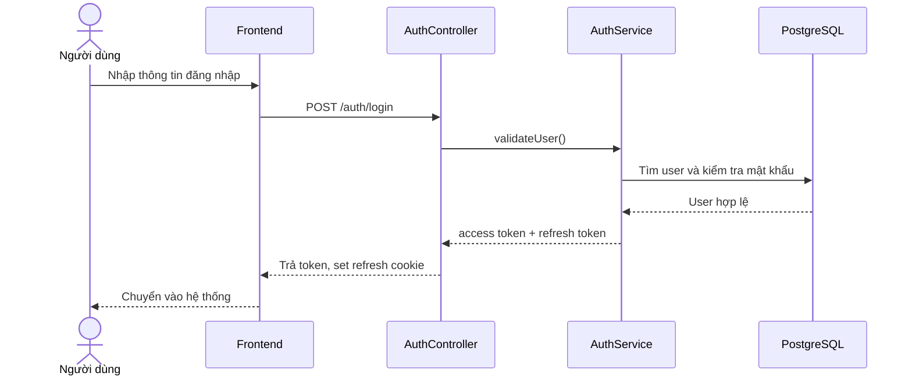

### 9.2. Thanh toán khóa học

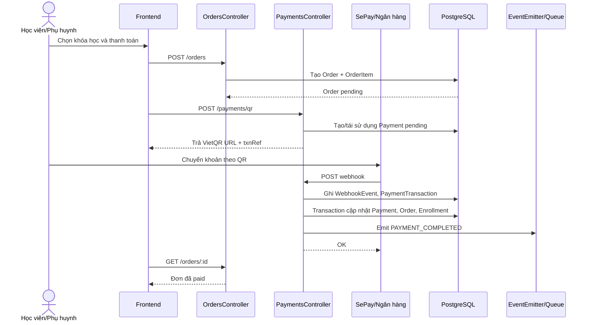

### 9.3. Giảng viên tạo khóa học

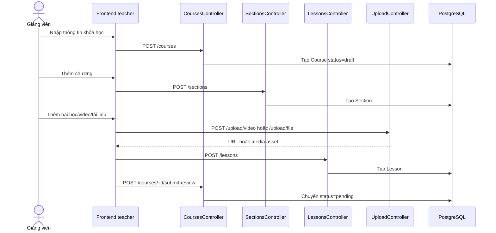

### 9.4. Phụ huynh liên kết học viên

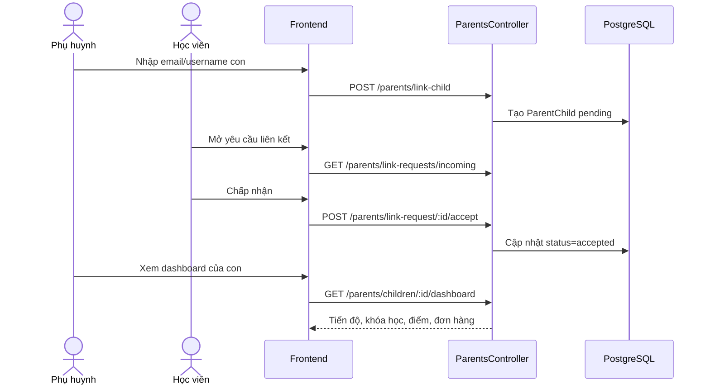

### 9.5. Giỏ hàng, coupon và tạo đơn hàng

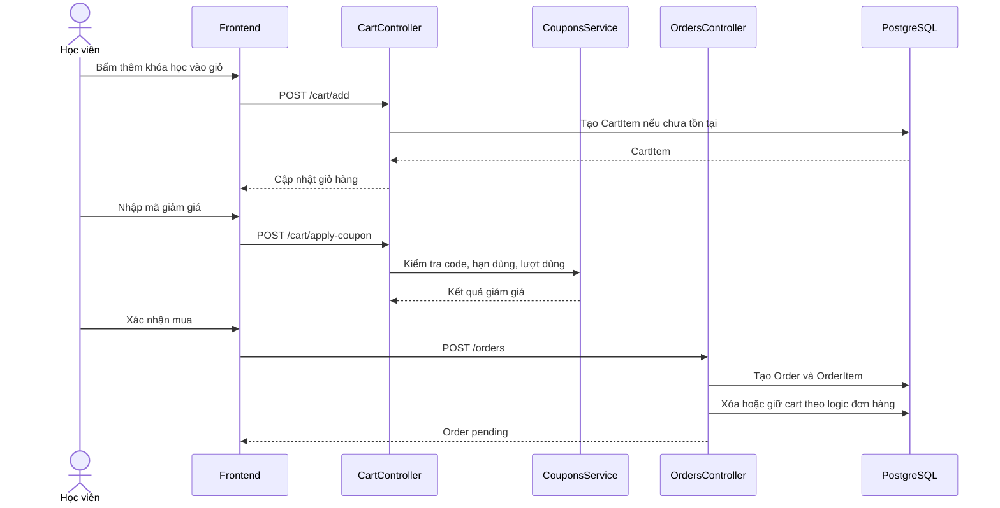

### 9.6. Học bài và cập nhật tiến độ

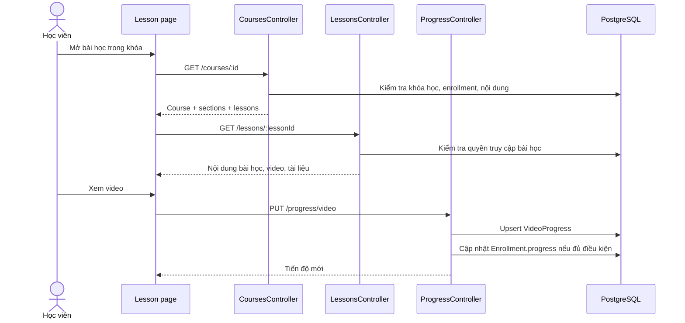

### 9.7. Nộp bài tập và chấm điểm

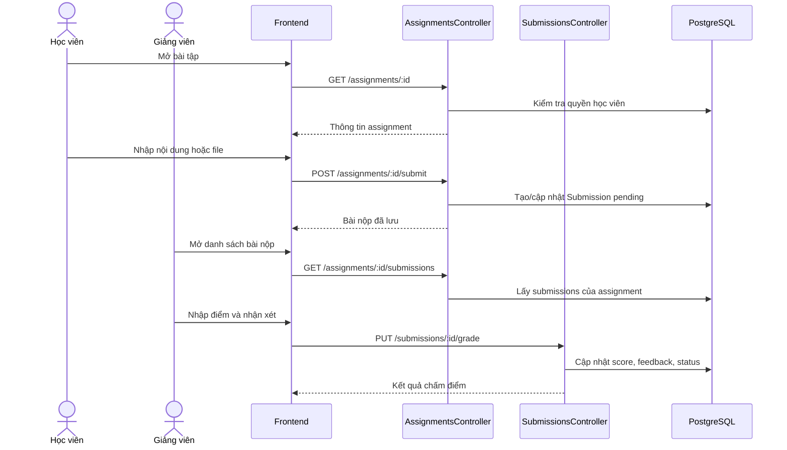

### 9.8. Làm quiz và xem kết quả

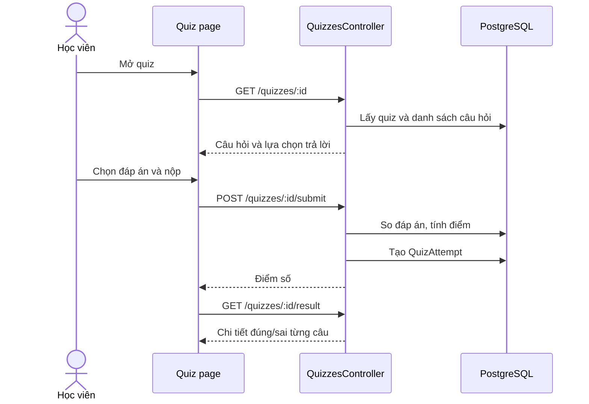

### 9.9. Sinh và xác minh chứng chỉ

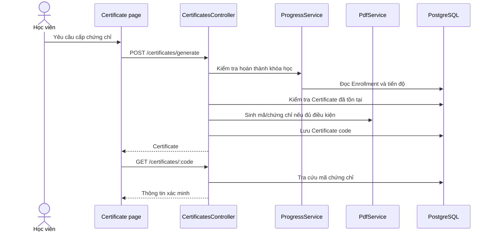

### 9.10. Yêu cầu hoàn tiền khi thanh toán dư

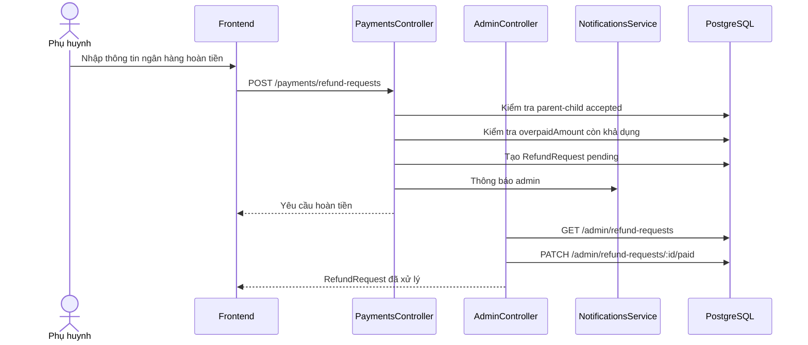

### 9.11. Ví giảng viên và rút tiền

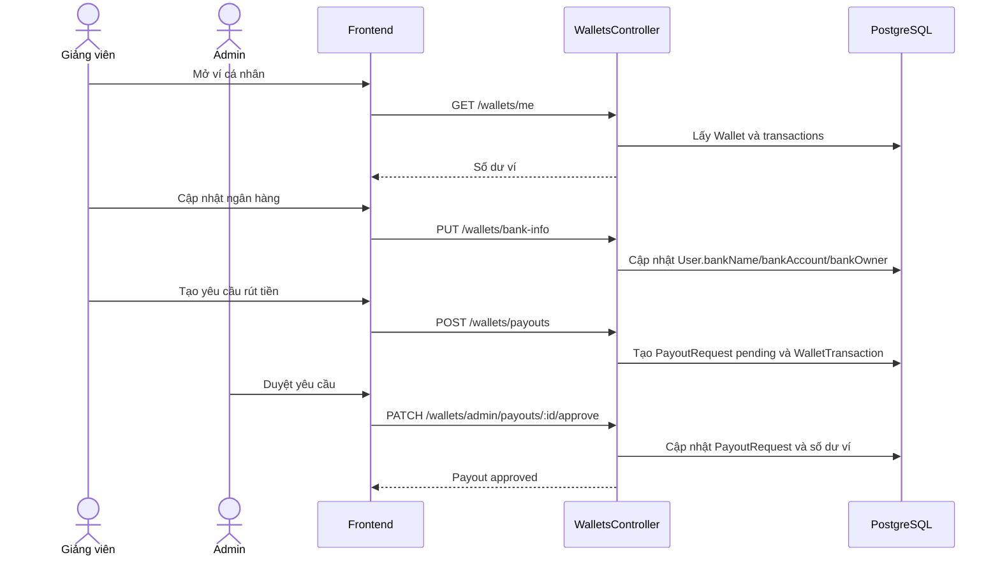

### 9.12. Admin duyệt khóa học

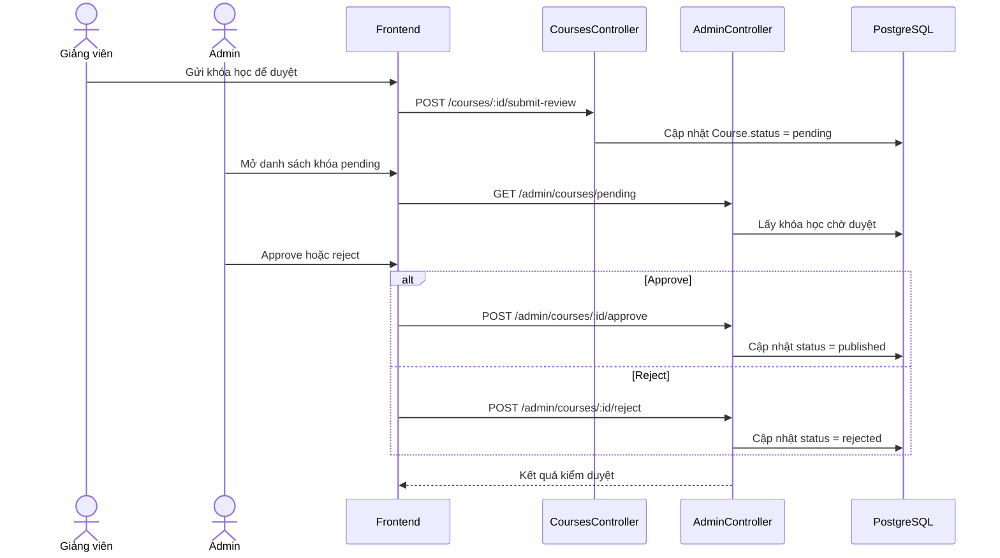

---

## 10. Biểu đồ hoạt động

### 10.1. Hoạt động thanh toán và ghi danh

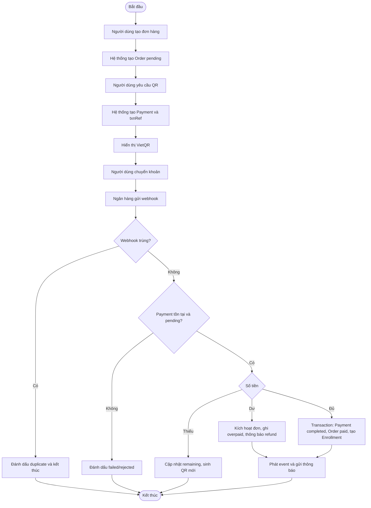

### 10.2. Hoạt động học bài

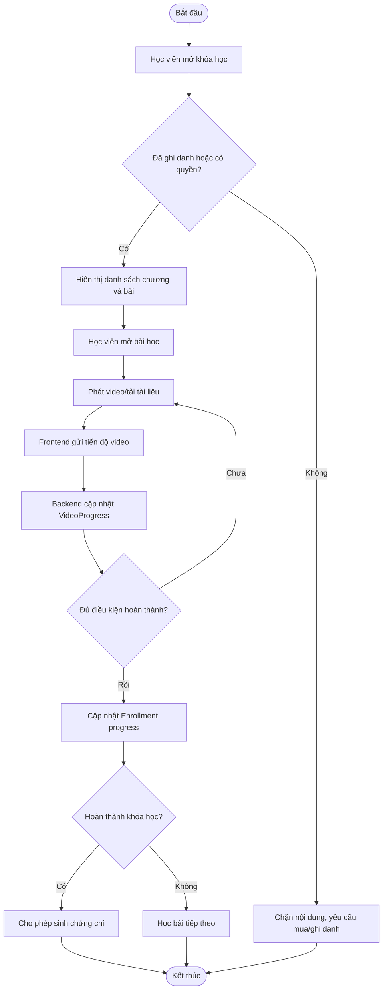

### 10.3. Hoạt động tạo và duyệt khóa học

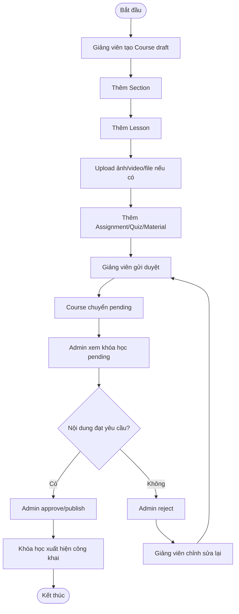

---

## 11. Thiết kế cơ sở dữ liệu

### 11.1. Sơ đồ quan hệ chính

Sơ đồ dưới đây thể hiện cơ sở dữ liệu theo cụm nghiệp vụ để dễ nhìn trước khi đi vào ER chi tiết:

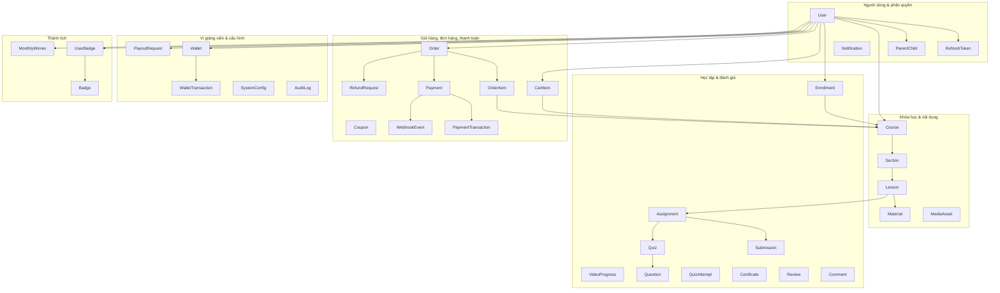

ER chi tiết theo các quan hệ cốt lõi:

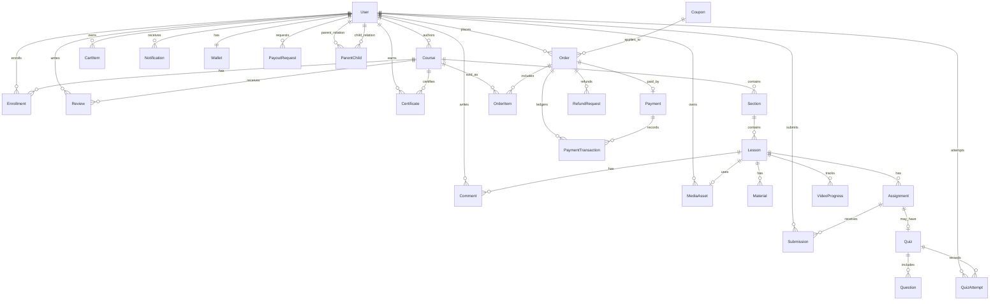

### 11.2. Danh sách bảng dữ liệu

| STT | Bảng | Mục đích | Trường chính | Quan hệ chính |
| --- | --- | --- | --- | --- |
| 1 | `User` | Lưu tài khoản và vai trò | `id`, `username`, `email`, `password`, `role`, `isActive`, `currentStreak` | Tạo course, enrollment, order, comment, wallet, parent-child |
| 2 | `SystemConfig` | Cấu hình hệ thống dạng key-value | `id`, `key`, `value`, `description` | Dùng cho phí nền tảng/cấu hình động |
| 3 | `Wallet` | Ví doanh thu của giảng viên | `id`, `userId`, `balance`, `pendingBalance`, `totalEarned` | 1-1 với User, có nhiều WalletTransaction |
| 4 | `WalletTransaction` | Lịch sử biến động ví | `id`, `walletId`, `amount`, `type`, `referenceId`, `idempotencyKey` | Thuộc Wallet |
| 5 | `PayoutRequest` | Yêu cầu rút tiền của giảng viên | `id`, `userId`, `amount`, `status`, `bankDetails`, `processedAt` | Thuộc User |
| 6 | `RefreshToken` | Phiên đăng nhập/refresh token | `id`, `token`, `userId`, `expiresAt` | Thuộc User |
| 7 | `Course` | Thông tin khóa học | `id`, `title`, `description`, `price`, `thumbnail`, `status`, `authorId` | Thuộc User, có Section, Enrollment, Review |
| 8 | `Section` | Chương/phần trong khóa học | `id`, `title`, `order`, `courseId` | Thuộc Course, có Lesson |
| 9 | `Lesson` | Bài học | `id`, `title`, `content`, `videoUrl`, `mediaAssetId`, `duration`, `order`, `sectionId` | Thuộc Section, có Material, Assignment, Comment |
| 10 | `MediaAsset` | Tài nguyên media upload | `id`, `ownerId`, `type`, `status`, `url`, `storageKey`, `hlsManifestKey`, `jobId` | Thuộc User, có thể gắn Lesson |
| 11 | `Material` | Tài liệu bài học | `id`, `title`, `fileUrl`, `fileType`, `fileSize`, `lessonId` | Thuộc Lesson |
| 12 | `Enrollment` | Ghi danh khóa học | `id`, `userId`, `courseId`, `status`, `progress` | Nối User - Course |
| 13 | `Assignment` | Bài tập | `id`, `title`, `type`, `lessonId`, `dueDate`, `maxScore`, `minScore` | Thuộc Lesson, có Submission, có thể có Quiz |
| 14 | `Submission` | Bài nộp của học viên | `id`, `assignmentId`, `studentId`, `content`, `fileUrl`, `score`, `feedback`, `status` | Thuộc Assignment và User |
| 15 | `Quiz` | Bài quiz gắn với assignment | `id`, `assignmentId`, `timeLimit` | 1-1 Assignment, có Question, QuizAttempt |
| 16 | `Question` | Câu hỏi quiz | `id`, `quizId`, `content`, `options`, `answer`, `score`, `order` | Thuộc Quiz |
| 17 | `QuizAttempt` | Lần làm quiz của học viên | `id`, `quizId`, `studentId`, `answers`, `score`, `maxScore` | Thuộc Quiz và User |
| 18 | `CartItem` | Khóa học trong giỏ hàng | `id`, `userId`, `courseId` | Nối User - Course |
| 19 | `Coupon` | Mã giảm giá | `id`, `code`, `discount`, `maxUses`, `usedCount`, `expiresAt`, `type` | Có thể thuộc User, áp dụng cho Order |
| 20 | `Order` | Đơn hàng | `id`, `userId`, `couponId`, `totalPrice`, `finalPrice`, `status` | Thuộc User, có OrderItem, Payment |
| 21 | `RefundRequest` | Yêu cầu hoàn tiền | `id`, `orderId`, `paymentId`, `parentId`, `childId`, `amount`, `bankName`, `status` | Thuộc Order và phụ huynh |
| 22 | `OrderItem` | Dòng khóa học trong đơn | `id`, `orderId`, `courseId`, `price` | Thuộc Order và Course |
| 23 | `Payment` | Thanh toán của đơn hàng | `id`, `orderId`, `amount`, `paidAmount`, `remainingAmount`, `overpaidAmount`, `status`, `txnRef` | 1-1 Order, có PaymentTransaction |
| 24 | `PaymentTransaction` | Ledger từng webhook/giao dịch | `id`, `paymentId`, `orderId`, `txnRef`, `amount`, `expectedAmount`, `status`, `rawPayload` | Thuộc Payment và Order |
| 25 | `AuditLog` | Nhật ký thay đổi quan trọng | `id`, `actorId`, `actorRole`, `action`, `entityType`, `before`, `after` | Ghi vết nghiệp vụ |
| 26 | `WebhookEvent` | Ghi nhận webhook chống trùng | `id`, `provider`, `eventKey`, `eventId`, `txnRef`, `payload`, `status` | Liên quan PaymentTransaction |
| 27 | `Review` | Đánh giá khóa học | `id`, `courseId`, `userId`, `rating`, `comment` | Thuộc Course và User |
| 28 | `Comment` | Bình luận bài học | `id`, `lessonId`, `userId`, `content`, `parentId` | Thuộc Lesson/User, tự liên kết replies |
| 29 | `Notification` | Thông báo người dùng | `id`, `userId`, `title`, `message`, `isRead`, `type` | Thuộc User |
| 30 | `Certificate` | Chứng chỉ hoàn thành | `id`, `userId`, `courseId`, `code`, `issuedAt` | Thuộc User và Course |
| 31 | `ParentChild` | Quan hệ phụ huynh - học viên | `id`, `parentId`, `childId`, `status` | Nối User parent và User child |
| 32 | `VideoProgress` | Tiến độ xem video | `id`, `userId`, `lessonId`, `completed`, `watchTime`, `watchedPercentage` | Nối User - Lesson |
| 33 | `Badge` | Huy hiệu thành tích | `id`, `code`, `name`, `icon`, `category`, `tier`, `requirement` | Có nhiều UserBadge |
| 34 | `UserBadge` | Huy hiệu đã nhận của user | `id`, `userId`, `badgeId`, `earnedAt` | Nối User - Badge |
| 35 | `MonthlyWinner` | Người thắng cuộc đua tháng | `id`, `userId`, `month`, `year`, `rank`, `xp`, `discount`, `couponCode` | Thuộc User |

### 11.3. Enum trong cơ sở dữ liệu

| Enum | Giá trị |
| --- | --- |
| `UserRole` | `student`, `teacher`, `parent`, `admin` |
| `CourseStatus` | `draft`, `pending`, `published`, `rejected` |
| `EnrollmentStatus` | `pending`, `active`, `cancelled` |
| `OrderStatus` | `pending`, `paid`, `failed`, `cancelled` |
| `PaymentStatus` | `pending`, `completed`, `failed` |
| `WebhookEventStatus` | `received`, `processed`, `duplicate`, `rejected`, `failed` |
| `MediaAssetType` | `VIDEO`, `IMAGE`, `FILE` |
| `MediaAssetStatus` | `PROCESSING`, `READY`, `FAILED`, `ORPHANED`, `DELETED` |
| `SubmissionStatus` | `pending`, `graded`, `passed`, `failed` |
| `CouponType` | `admin`, `streak`, `platform` |
| `WalletTransactionType` | `EARNING`, `WITHDRAWAL_REQUEST`, `WITHDRAWAL_APPROVED`, `WITHDRAWAL_REJECTED`, `ADJUSTMENT` |
| `PayoutStatus` | `PENDING`, `APPROVED`, `REJECTED`, `CANCELLED` |
| `RefundRequestStatus` | `PENDING`, `APPROVED`, `REJECTED`, `PAID` |

### 11.4. Ràng buộc và chỉ mục đáng chú ý

| Bảng | Ràng buộc/chỉ mục | Ý nghĩa |
| --- | --- | --- |
| `User` | `username`, `email` unique | Không trùng tài khoản/email |
| `Enrollment` | unique `userId, courseId` | Một học viên chỉ ghi danh một lần vào một khóa |
| `CartItem` | unique `userId, courseId` | Không thêm trùng khóa học trong giỏ |
| `Submission` | unique `assignmentId, studentId` | Mỗi học viên có một bài nộp cho mỗi bài tập |
| `QuizAttempt` | unique `quizId, studentId` | Mỗi học viên có một lượt ghi nhận kết quả quiz |
| `Review` | unique `courseId, userId` | Một học viên chỉ đánh giá một khóa một lần |
| `Certificate` | unique `userId, courseId`, `code` unique | Mỗi khóa có một chứng chỉ/user, mã xác minh duy nhất |
| `ParentChild` | unique `parentId, childId` | Không tạo trùng quan hệ phụ huynh - học viên |
| `VideoProgress` | unique `userId, lessonId` | Một bản ghi tiến độ cho mỗi user/bài học |
| `Payment` | `orderId` unique, `txnRef` unique | Một payment chính cho mỗi order, mã giao dịch không trùng |
| `WebhookEvent` | `eventKey`, `eventId` unique | Chống xử lý webhook lặp |
| `WalletTransaction` | `idempotencyKey` unique | Chống ghi doanh thu trùng |

---

## 12. API chính theo module

| Module | Endpoint tiêu biểu | Quyền |
| --- | --- | --- |
| Auth | `POST /auth/register`, `POST /auth/login`, `POST /auth/refresh`, `GET /auth/profile`, `PUT /auth/profile` | Public/User |
| Users | `GET /users/me/dashboard`, `GET /users/me/learning-summary`, `PUT /users/me/streak/check-in`, `GET /users/public/teachers` | User/Public |
| Courses | `GET /courses`, `GET /courses/search`, `POST /courses`, `PUT /courses/:id`, `POST /courses/:id/submit-review` | Public/Teacher/Admin |
| Sections | `POST /sections`, `GET /sections`, `PATCH /sections/:id`, `POST /sections/reorder` | Public/Teacher/Admin |
| Lessons | `POST /lessons`, `GET /lessons/:id`, `PATCH /lessons/:id`, `DELETE /lessons/:id` | User/Teacher/Admin |
| Materials | `POST /materials`, `GET /materials`, `PATCH /materials/:id`, `DELETE /materials/:id` | User/Teacher/Admin |
| Assignments | `POST /assignments`, `POST /assignments/:id/submit`, `GET /assignments/:id/submissions` | Student/Teacher/Admin |
| Quizzes | `POST /quizzes`, `POST /questions`, `POST /quizzes/:id/submit`, `GET /quizzes/:id/result` | Student/Teacher/Admin |
| Cart | `GET /cart`, `POST /cart/add`, `POST /cart/apply-coupon`, `DELETE /cart/item/:id` | User |
| Orders | `POST /orders`, `GET /orders/me`, `GET /orders/:id` | User |
| Payments | `POST /payments/qr`, `POST /payments/webhook`, `POST /payments/refund-requests` | User/System |
| Parents | `POST /parents/link-child`, `GET /parents/me/children`, `GET /parents/children/:id/dashboard` | Parent/Student |
| Certificates | `GET /certificates`, `POST /certificates/generate`, `GET /certificates/:code` | Student/Public verify |
| Wallets | `GET /wallets/me`, `POST /wallets/payouts`, `GET /wallets/admin/payouts` | Teacher/Admin |
| Admin | `GET /admin/dashboard`, `GET /admin/users`, `GET /admin/courses`, `GET /admin/stats/revenue` | Admin |
| Upload | `POST /upload/video`, `POST /upload/image`, `POST /upload/file` | User theo role |
| Notifications | `GET /notifications`, `PUT /notifications/read-all`, `DELETE /notifications/:id` | User |

---

## 13. Luồng nghiệp vụ chi tiết

### 13.1. Luồng mua khóa học

1. Người dùng đăng nhập.
2. Người dùng xem danh sách khóa học published.
3. Người dùng thêm khóa học vào giỏ hàng.
4. Nếu có mã giảm giá, người dùng áp dụng coupon.
5. Người dùng tạo đơn hàng.
6. Hệ thống sinh mã VietQR.
7. Người dùng thanh toán bằng chuyển khoản.
8. Webhook ngân hàng gọi về backend.
9. Backend kiểm tra trùng, kiểm tra số tiền, cập nhật payment/order.
10. Backend tạo enrollment cho học viên.
11. Người dùng vào khóa học và bắt đầu học.

### 13.2. Luồng học và hoàn thành khóa

1. Học viên mở khóa học đã ghi danh.
2. Backend kiểm tra quyền truy cập nội dung.
3. Học viên xem bài học, video và tài liệu.
4. Frontend gửi tiến độ video về backend.
5. Học viên làm assignment/quiz nếu có.
6. Hệ thống cập nhật tiến độ khóa học.
7. Khi đủ điều kiện, học viên tạo chứng chỉ.
8. Chứng chỉ có mã xác minh để tra cứu.

### 13.3. Luồng giảng viên quản lý nội dung

1. Giảng viên đăng nhập bằng role `teacher`.
2. Tạo khóa học ở trạng thái `draft`.
3. Thêm chương, bài, tài liệu, bài tập/quiz.
4. Upload media nếu cần.
5. Gửi khóa học để admin duyệt.
6. Admin approve thì khóa học chuyển published.
7. Khi có học viên mua, doanh thu được ghi nhận vào ví giảng viên.
8. Giảng viên gửi yêu cầu rút tiền.

### 13.4. Luồng phụ huynh theo dõi con

1. Phụ huynh đăng nhập và gửi yêu cầu liên kết học viên.
2. Học viên chấp nhận yêu cầu.
3. Phụ huynh xem dashboard học tập của con.
4. Phụ huynh xem khóa học, tiến độ, điểm và đơn hàng.
5. Nếu đơn hàng thanh toán dư, phụ huynh gửi yêu cầu hoàn tiền.
6. Admin xử lý refund.

---

## 14. Kiểm tra code và nhận xét hiện trạng

### 14.1. Điểm đã có trong code

| Hạng mục | Hiện trạng |
| --- | --- |
| Phân quyền | Có JWT guard và role guard cho student/teacher/parent/admin |
| Tách module | Backend chia module rõ: auth, courses, lessons, payments, wallets, admin... |
| Chống trùng thanh toán | Có `WebhookEvent`, `PaymentTransaction`, `idempotencyKey` |
| Thanh toán thiếu/dư | Có xử lý underpayment, overpayment và thông báo |
| Upload an toàn hơn | Có kiểm tra MIME, dung lượng và magic bytes |
| Quan hệ dữ liệu | Prisma schema có quan hệ đầy đủ giữa user, course, order, progress |
| Frontend API | `api-service.ts` gom API theo nhóm và có interceptor refresh token |
| Queue/event | AppModule đăng ký Bull queue và EventEmitter cho tác vụ nền |

### 14.2. Rủi ro/cần làm rõ khi báo cáo với thầy

| Vấn đề | Ghi chú |
| --- | --- |
| Một số comment/log trong code bị lỗi encoding | Không ảnh hưởng logic, nhưng nên chuẩn hóa UTF-8 để đọc dễ hơn |
| Upload video/HLS | Schema có `MediaAsset` và queue video; cần demo đúng môi trường có Redis/storage/worker |
| Thanh toán VietQR | Phụ thuộc biến môi trường ngân hàng và webhook từ provider |
| Kiểm thử | Backend có nhiều file spec; khi trình bày nên chạy test trước buổi báo cáo nếu môi trường DB/Redis đã sẵn sàng |
| Admin UI | Có trang `/admin`, nhưng mức độ đầy đủ phụ thuộc component hiện có và API mapping |

---

## 15. Kết luận

Dự án LumiLearn LMS hiện đã có cấu trúc tương đối đầy đủ cho một hệ thống học trực tuyến: quản lý người dùng theo vai trò, tạo và duyệt khóa học, học tập và theo dõi tiến độ, bài tập/quiz, giỏ hàng - đơn hàng - thanh toán, phụ huynh theo dõi học viên, chứng chỉ, gamification, ví giảng viên và quản trị hệ thống.

Về thiết kế, hệ thống sử dụng kiến trúc frontend/backend tách biệt, backend module hóa theo nghiệp vụ, cơ sở dữ liệu quan hệ bằng PostgreSQL/Prisma và có cơ chế queue/event cho tác vụ nền. Các luồng quan trọng như thanh toán và cấp quyền học đã có xử lý transaction, chống trùng webhook và ghi ledger, phù hợp để trình bày trong báo cáo phân tích thiết kế hệ thống.
